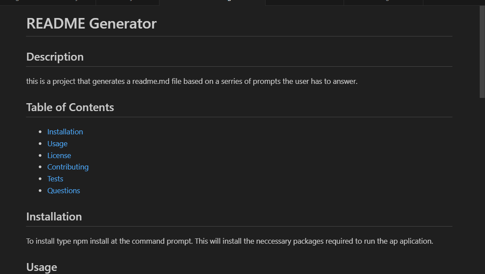
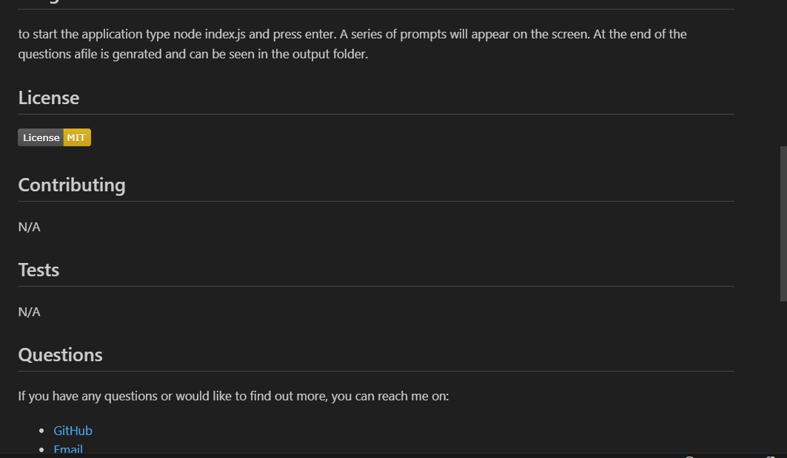

# Readme-Generator
# Description
This is an application that uses node.js to generate a readme file after ansering a series of questions. it uses the inquirer package.

## How it works

When a user views the answers a series of questions the answers are stored and later add to the generated readme file in the output folder.

Here is a link to the video walk through of how it works: 
https://app.screencastify.com/v3/watch/3n1ifnra8xu6VxfhwCB6 

# Screenshots

## License

Please see original GitHub repository.